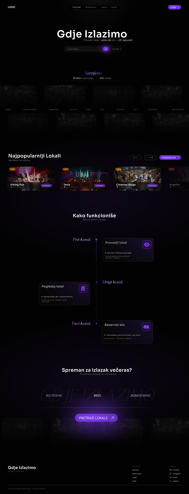

<div align="center">



<br />
<br />

# gdje-izlazimo.ba

**The go-to platform for venue discovery and table reservations in Bosnia & Herzegovina.**

Ditch the Instagram DMs and phone calls — discover venues, check availability, and book your spot in seconds.

<br />

[](https://angular.io/)
[](https://spring.io/projects/spring-boot)
[](https://www.postgresql.org/)
[](https://www.keycloak.org/)
[](https://tailwindcss.com/)

</div>

---

## 📖 Overview

**gdje-izlazimo.ba** (lit. *"where are we going out"*) is a full-stack web platform designed for young, socially active people in Bosnia & Herzegovina who want to discover clubs, bars, and restaurants — and actually book a table without the friction.

> Built using Scrum methodology, sprint planning, and iterative delivery.

---

## ✨ Features

### 🔐 Authentication
Secure, role-based access powered by **Keycloak** with JWT tokens. Three distinct roles keep the platform structured: **User**, **Venue Owner**, and **Admin**.

### 🏛️ Venue Discovery
Browse a curated list of venues with rich detail pages — images, descriptions, opening hours, table types, and pricing. Filter by category, search by name, and explore an **interactive map** with live venue pins across the city.

### 🗺️ Interactive Venue Map
A full modern map view with pinned locations for every registered venue. Tap any pin to preview the venue and jump straight to its detail page.

### 🔍 Search & Filtering
Find exactly what you're looking for with real-time search by venue name and category-based filtering — all paginated for smooth browsing.

### 📅 Reservation System
A complete reservation flow with transparent status tracking:

```
PENDING → ACCEPTED / REJECTED / CANCELLED
```

- Choose date, time, table type, and party size
- One reservation per user per venue per day
- Cancel up to 2 hours before your booking
- Mandatory rejection reasons from venues

### ❤️ Favorites
Save your go-to spots and build a personal list of favourite venues for quick access.

### 🎟️ Events System
Venues can publish events — from themed nights to live music — so users never miss what's happening nearby.

### ⭐ Ratings & Reviews
Users can rate and review venues after their visit, helping others make better decisions and giving venue owners valuable feedback.

### 📊 Venue Owner Dashboard
A clean management interface for venue owners to:
- Accept or reject reservations with required reasoning
- View a daily reservation overview
- Monitor ratings and event performance
- Add table quantity and table types to the venue
- Add images
- Add events
- Manage working operating hours / days

### 🛡️ Admin Panel
Platform-level control for administrators to manage venues, monitor activity, and ensure quality across the board.

### 📧 Email Notifications
Automated emails keep everyone in the loop:
- Reservation received
- Reservation accepted or rejected
- Reservation cancelled

---

## 🏗️ Architecture

```
┌─────────────────────────────────────────────────┐
│                   Angular Frontend              │
│              Tailwind CSS · SPA                 │
└────────────────────┬────────────────────────────┘
                     │ REST API
┌────────────────────▼────────────────────────────┐
│              Spring Boot Backend                │
│            JPA / Hibernate · REST               │
└──────┬──────────────────────────┬───────────────┘
       │                          │
┌──────▼──────┐          ┌────────▼────────┐
│  PostgreSQL │          │    Keycloak     │
│  Database   │          │  Auth Server    │
└─────────────┘          └─────────────────┘
```

**Frontend** → Angular SPA styled with Tailwind CSS  
**Backend** → Spring Boot REST API with JPA/Hibernate  
**Auth** → Keycloak (JWT-based, role-aware)  
**Database** → PostgreSQL

---

## 👥 User Roles

| Role | Capabilities |
|------|-------------|
| **User** | Browse venues, make & track reservations, manage favourites, write reviews, view events |
| **Venue Owner** | Manage reservations, publish events, view dashboard stats |
| **Admin** | Full platform management, venue approval, activity monitoring |

---

## 🎯 MVP Success Metrics

| Metric | Target |
|--------|--------|
| Active users | 80+ |
| Registered venues | 10+ |
| Processed reservations | 100+ |

---

## 🚀 Roadmap

- [ ] Featured venue listings & promotions
- [ ] QR-based check-in
- [ ] Advanced venue analytics
- [ ] Mobile app (iOS & Android)

---

## 🛠️ Tech Stack

| Layer | Technology |
|-------|-----------|
| Frontend | Angular, Tailwind CSS |
| Backend | Spring Boot, REST API |
| ORM | JPA / Hibernate |
| Auth | Keycloak (JWT) |
| Database | PostgreSQL |
| Methodology | Scrum · Solo Development |

---

## 👨‍💻 Author

**Alexander Jason Kaiser**  
Software Developer & UI Designer

Built end-to-end as a solo project — from product design and sprint planning to implementation and delivery.

<div align="center">


</div>
